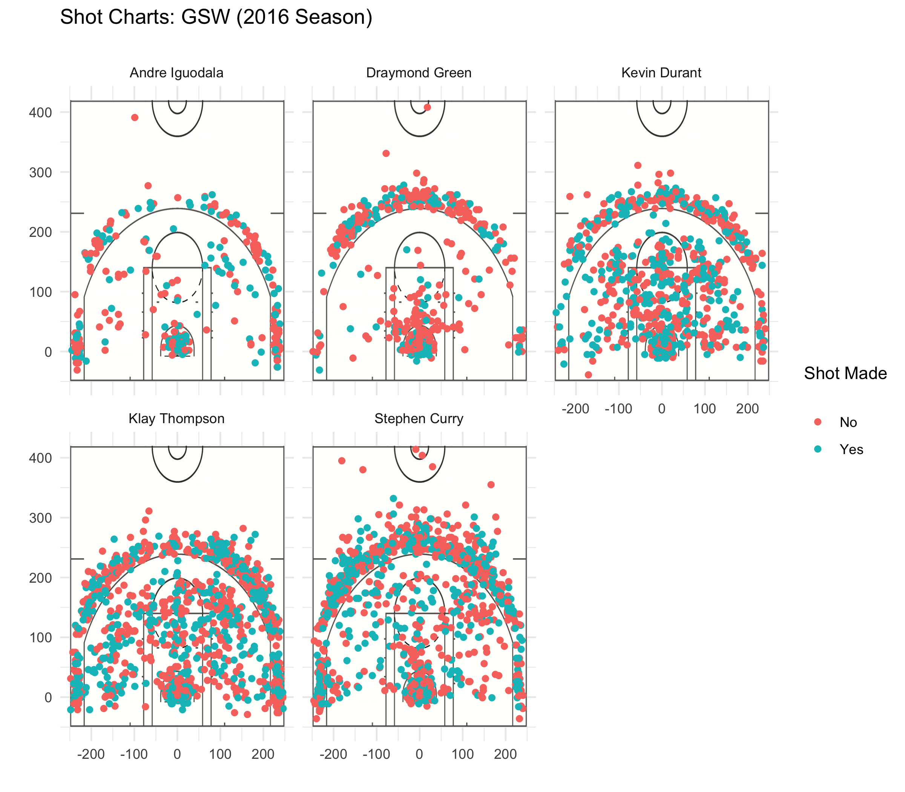

```{r, echo=F, results='hide', message=FALSE}
library(dplyr)
library(knitr)

# data types for each column in the csv files
col_types <- c(
  'factor', # team_name
  'character', # game_date
  'integer', # season 
  'integer', # period
  'integer', # minutes_remaining
  'integer', # seconds_remaining
  'factor', # shot_made_flag
  'factor', # action_type
  'factor', # shot_type
  'integer', # shot_distance
  'factor', # opponent
  'real', # x
  'real', # y
  'character', # name
  'integer' # minute
)

shot_data <- read.csv('../data/shots-data.csv', 
                      colClasses=col_types,
                      stringsAsFactors=F)
```
```{r, echo=F}
kable(
  arrange(
    summarise(
      group_by(shot_data[shot_data$shot_type == '2PT Field Goal',], name),
      total = length(shot_made_flag),
      made = sum(shot_made_flag == 'shot_yes'),
      perc_made = made/total
    ), 
    desc(perc_made)
  )
)
```

```{r, echo=F}
kable(
  arrange(
    summarise(
      group_by(shot_data[shot_data$shot_type == '3PT Field Goal',], name),
      total = length(shot_made_flag),
      made = sum(shot_made_flag == 'shot_yes'),
      perc_made = made/total
    ), 
    desc(perc_made)
  )
)
```

```{r, echo=F}
kable(
  arrange(
    summarise(
      group_by(shot_data, name),
      total = length(shot_made_flag),
      made = sum(shot_made_flag == 'shot_yes'),
      perc_made = made/total
    ), 
    desc(perc_made)
  )
)
```

```{r out.width='80%', echo=F, fig.align='center'}

```

