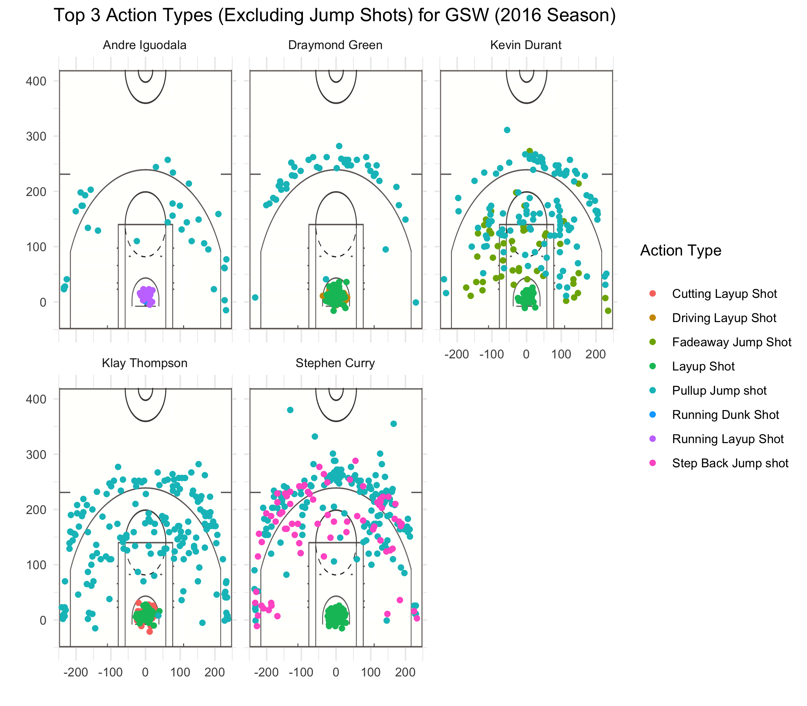

Workout 1
================
Dominic Fannjiang

## Introduction

Do you truly know why the Warriors are the juggernaut that they are?
It’s easy to observe that the Warriors are the best 3-point shooting
team in the NBA, given that Stephen Curry (just to name one player) is
the human highlight real that he is. But beyond that fact, does the
world know the exact reasons why the Warriors can dominate every NBA
team?

## Motivation

Do you merely know the Warriors as a 3-point shooting machine? Are they
simply a one-trick pony? Is it just a matter of figuring out their one
or two strengths and taking them away? In the following report, we seek
to better understand these questions and find out some of the true
reasons why the Warriors are so good.

## Background

The world all knows they’re the best 3-point shooting team in the NBA.
That’s comes to no surprise, especially when Stephen Curry and Klay
Thompson are shooting 46.72% and 47.13% from beyond the arc,
respectively. Moreover, the Warriors now have Kevin Durant, who is
practically a juggernaut on his own given his size, speed, length,
shooting skills, and performance in the paint. And if that’s not enough,
they have great defensive players such as Draymond Green, and great
bench players such as Shaun Livingston and others who can put up points
when the virtually all-star starting 5 need a break. It’s not even a
surprise to anyone anymore whenn they beat teams by a 20+ point margins.
However, the Warriors cannot simply be relying on all-star power and
crazy 3-point shooting, and in this report, we seek to uncover more of
the hidden details as to why the Warriors are as good as they are.

## Data

In this report, we use data from the 2016 season for 5 Warriors players:
Stephen Curry, Klay Thompson, Kevin Durant, Andre Iguodala, and Draymond
Green. Each row in our data table represents one shot taken by a
particular player during a particular game, and for each shot, we have
information such as where the shot was taken, the distance from where
the shot was taken to the hoop, the type of action the player performed
to take that shot, whether the shot was successful, and at what time
during the game that that shot was taken. From this data, we can look at
patterns such as where players take their shot and what kind of shots
they take.

## Analysis and Discussion

We can first begin with the probably obvious fact that a successful NBA
team has to shoot well from 2-point range, not just 3-point range. Below
we can see the effective shooting percentage from 2-point range for each
of the 5 players, sorted by decreasing order of percentage:

##### 2-point Effective Shooting %, by Player

| name           | total | made | perc\_made |
| :------------- | ----: | ---: | ---------: |
| Andre Iguodala |   210 |  134 |  0.6380952 |
| Kevin Durant   |   643 |  390 |  0.6065319 |
| Stephen Curry  |   563 |  304 |  0.5399645 |
| Klay Thompson  |   640 |  329 |  0.5140625 |
| Draymond Green |   346 |  171 |  0.4942197 |

Right away, we can see it’s not just Curry who’s an efficient shooter -
Andre Iguodala, who isn’t even part of the starting 5, shoots 63.8% from
the field\! That’s insane. Yes, he’s attempting a lot fewer shots than
Curry or Durant, but still, this shows that the Warriors have *depth*.
In other words, they don’t have to just rely on superstars such as Curry
and Durant.

And now we move on to the 3-point and overall shooting. Below we see 2
tables:

1.  The effective shooting percentage from 3-point range for each of the
    5 players, sorted by decreasing order of percentage:
2.  The effective shooting percentage from any range for each of the 5
    players, sorted by decreasing order of percentage:

##### 3-point Effective Shooting %, by Player

| name           | total | made | perc\_made |
| :------------- | ----: | ---: | ---------: |
| Klay Thompson  |   580 |  246 |  0.4241379 |
| Stephen Curry  |   687 |  280 |  0.4075691 |
| Kevin Durant   |   272 |  105 |  0.3860294 |
| Andre Iguodala |   161 |   58 |  0.3602484 |
| Draymond Green |   232 |   74 |  0.3189655 |

##### Overall Effective Shooting %, by Player

| name           | total | made | perc\_made |
| :------------- | ----: | ---: | ---------: |
| Kevin Durant   |   915 |  495 |  0.5409836 |
| Andre Iguodala |   371 |  192 |  0.5175202 |
| Klay Thompson  |  1220 |  575 |  0.4713115 |
| Stephen Curry  |  1250 |  584 |  0.4672000 |
| Draymond Green |   578 |  245 |  0.4238754 |

These numbers should come to no one’s surprise. The Warriors are simply
a good shooting team. Again, it’s not just the superstars that are
shooting effectively. But it’s more than just the fact that everyone is
good on the Warriors - that’s too simple of an explanation. Instead,
lets take a deeper look into where these 5 players are attempting their
shots.

From these shot charts, yes, we can see that everyone is making shots
from all over the court. However, we do see players shooting from
certain areas more frequently. Andre Iguodala is mostly scoring from the
paint or from the side of the 3-point arc. Draymond is making shots from
the paint or from the top of 3-point arc. Durant and Thompson and Curry
are making shots from everywhere, the Curry definitely attempts and
makes more 3-point shots while Durant and Thompson’s shot charts fill
more of the mid-range area.

Why don’t these shot charts just show each player making shots from all
over the place? One would think that a player would have to mix up where
they shoot to keep their opponents on their toes. If not, their
opponents would easily figure out where they need to guard each of the
Warriors players. However, the fact that the Warriors are so dominant
means that the observations made in the previous paragraph are evidence
of a *system* - a systematic way that the Warriors play in order to give
players the best chance to make shots at certain areas. In other words,
it’s precisely because of the Warriors’ teamwork and system play that
allows each player to play to and develop their strengths and niche
roles on the team and still dominate every team.

In fact, we can explore each players’ niche roles a little more by
looking at the type of actions each of these players take to make their
shots.

From these charts, right away we can see that everyone is attempting a
lot of jump shots. Jump shots happen to be the most basic shot type and
most popular attempted shot for each of the 5 players, and this data is
what we expect, given the high effective shooting percentages that we
saw earlier for all players for both 2 and 3-point shots. However, they
also attempt other kinds of shots. Below, we can see what these other
shots
are:

Here, we still see that everyone is attemping pullup jump shots.
However, some more distinct patterns appear. It seems that many of
Iguodala’s points come from running layup shots, most likely due to
breakaways where Iguodala is sprinting down the court, someone passes
him the ball, and he makes a running layup. Green also makes layups, but
many of them are simple layup shots, which come from another player
passing the ball to him at the post, and him making the layup, and
driving layup shots, which come from Green having the ball and then
driving to the basket and making the layup on his own. For Durant, we
see a unique affinity for the fadeaway shot, which usually happens in
cases where he is isolated - 1 on 1 with another defender - and has to
make the shot. Thompson makes pullup jump shots everywhere, but he also
has many cutting layup shots, which happens when Thompson is away from
the basket and then suddenly sprints to the basket, and on the way,
another player strategically passes him the ball so that Thompson can
make the layup. Finally, for Curry, we see that he utilizes the step
back jump shot a lot, which happens when he is 1 on 1 with another
defender and makes moves and suddenly steps back to create space and
make the shot. These are all interesting details, but the main takeaway
is that given that the Warriors are so successful, the niches we see
each of these 5 players having on the team means that Warriors players
are really working together systematically to help eachother attempt and
make the particular shots that each player is most effective at against
the opposing team. Moreover, as a whole, the Warriors are employing many
types of shooting tactics to score points.

## Conclusion

Many people simply know the Warriors as that team with Stephen Curry,
the little guy who drains 3’s, and Kevin Durant, who is a bonafide
superstar and can dominate in every aspect of the game. But when we
really look at the data, we can see that the Warriors are much more than
that. The Warriors are so successful not only because Durant and Curry
and others on the Warriors are much more than good shooters, but because
they work extremely well together to bring out the best out of everyone
so that no one person has to do everything on the court and “carry the
team on his back.” However, you could say that this makes the Warriors
not an *inherently* dominant team. In other words, the Warriors are not
dominant simply because they have good players, but they are only able
to dominate because they use good strategy and teamwork to bring the
best in their already good players. This observation should come to no
surprise - there have been plenty of instances where great individual
players lose to teams with simply great teamwork. Therefore, we
shouldn’t simply think of the Warriors as invicible - we should think
of them as, to put it simply, a great *team* of great individuals
players that work well together.

## References

[NBA data
source](https://github.com/ucb-stat133/stat133-hws/blob/master/data/)
